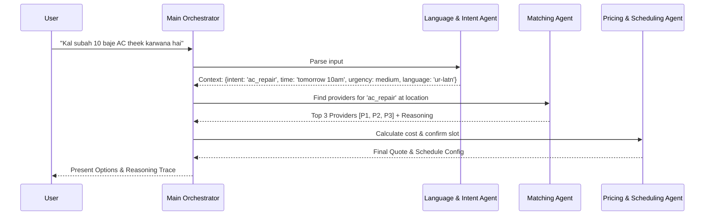

# Agent Workflow Design
## KaamWala AI Orchestration

Google Antigravity acts as the central router, passing context between specialized sub-agents.

### 1. Workflow Diagram

### 2. Agent Definitions

#### A. Intent & Language Normalization Agent
- **Input**: Raw user text/voice transcript.
- **Responsibilities**: Detect language, correct spelling, extract intent (service type), extract temporal/spatial constraints, determine urgency/complexity.
- **Output**: Standardized JSON context object.

#### B. Provider Discovery & Matching Agent
- **Input**: Standardized context, user location.
- **Responsibilities**: Query DB for available providers, apply multi-factor scoring (distance, reliability, experience, rating).
- **Output**: Ranked list of providers with specific matching reasoning.

#### C. Pricing & Scheduling Agent
- **Input**: Ranked providers, service complexity, urgency.
- **Responsibilities**: Apply dynamic pricing multipliers, verify calendar availability, add travel buffers.
- **Output**: Finalized price breakdown and time slots.

#### D. Quality & Dispute Agent (Post-Booking)
- **Input**: User feedback, completion status.
- **Responsibilities**: Analyze sentiment of reviews, flag anomalies, handle simulated refund requests or escalations.
- **Output**: Reputation updates to DB, escalation triggers.
