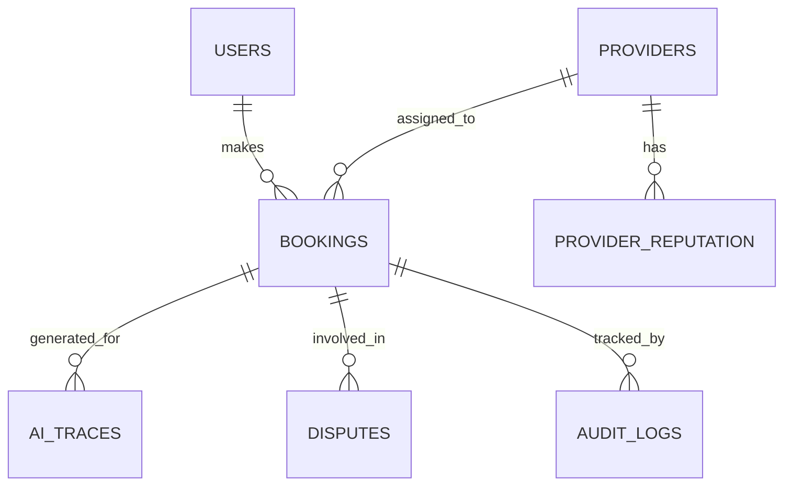

# Database Schema (KaamWala AI)

## Purpose & Scope
Defines the core data models, relationships, and indexing strategies for the KaamWala AI platform. Designed to support high read/write throughput for up to 10K+ concurrent users with scalability in mind.

## ER Diagram

## Core Entities
1. **Users**: Customers booking services.
2. **Providers**: Professionals delivering services.
3. **Bookings**: Service appointments with lifecycle states (PENDING, MATCHING, CONFIRMED, IN_PROGRESS, COMPLETED, CANCELLED, DISPUTED).
4. **Disputes**: Issue tickets tied to bookings.
5. **AI_Traces**: Stores reasoning steps for transparency.
6. **Provider_Reputation**: Historical rating and fairness index for matching algorithm.
7. **Audit_Logs**: Append-only table tracking system changes.

## Relationships & Indexing Strategy
- **Indexes**: B-Tree on (provider_id, status) for fast availability checks. Geospacial indexing (PostGIS or similar) on provider locations for proximity matching.
- **Foreign Keys**: Enforce referential integrity between Bookings, Users, and Providers.

## AI Orchestration
- Antigravity parses booking history to personalize interactions.
- Stores trace summaries directly in `AI_Traces` for the Reasoning Trace System.

## Future Scalability
- Sharding strategy based on geographic regions.
- Read replicas for heavy analytics queries.
- Android compatibility ensures API can serve mobile offline-sync payloads via Last-Modified tracking.
