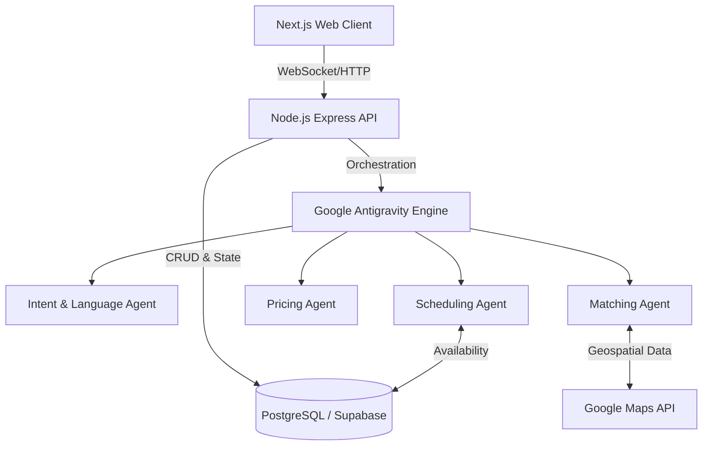

# System Architecture
## KaamWala AI

### 1. High-Level Architecture
The system follows a clean, decoupled client-server architecture with an intelligent AI middleware layer.

### 2. Frontend Layer (Next.js)
- **Framework**: Next.js (App Router) for hybrid SSR/SSG.
- **Styling**: Tailwind CSS + ShadCN UI for a premium, consistent design system.
- **Animations**: Framer Motion for micro-interactions and smooth transitions.
- **State Management**: React Context + Zustand for local state; SWR/React Query for server state.

### 3. Backend Layer (Node.js)
- **Framework**: Express.js or NestJS.
- **Real-time**: Socket.IO for streaming reasoning traces and live booking updates to the client.
- **AI Integration**: Custom SDK wrapper around Google Antigravity to manage the multi-agent state machine.

### 4. Data Layer (PostgreSQL)
- Relational database handling Users, Providers, Services, Bookings, and Reviews.
- Geospatial extensions (PostGIS) for distance-based queries.

### 5. External Integrations
- **Google Maps/Places API**: For location normalization, distance matrix, and travel time calculations.
- **Authentication**: Firebase Auth or Clerk.
